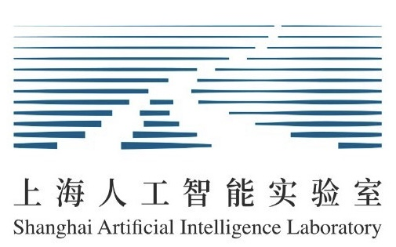

# FlowEval
Official repo of FlowEval: A Consensus-Based Dialogue Evaluation Framework Using Segment Act Flows.



This work is led by [LaVi Lab](https://lwwangcse.github.io/lab.html), CSE@CUHK and Shanghai AI Laboratory.

## Data
In this work, we have two data contributions: 
- We provide the first large-scale segment act dataset based on dialogues from ConvAI2 and DailyDialog. Please check the `ActDial` folder and our paper for more information.
- We extend the original [Controllable Dialogue](https://aclanthology.org/N19-1170/) with segment act annotation and human evaluation. After the extension, this dataset can be easily adopted as a new test set for future open-domain dialogue evaluation study. Please check the `Controllable_Dialogue` folder and our paper for more information.

### Other Benchmark Datasets
We use other two benchmark datasets: [DSTC9](https://github.com/ictnlp/DialoFlow/tree/main/FlowScore/data) and [FED Dataset](http://shikib.com/fed_data.json). Please go to their official repo to download or for more information. Essential steps to process the data is documented in our paper.

## Model
We release two models in this work:
- A segment act classification model that takes single segment text as input and predicts its segment act. It is adopted to automatically obtain the segment act flow of a new dialogue, when human annotation is too arduous. [(Download)](placeholder)
- ActBERT, a masked segment act model resembling the masked language model as BERT, is designed to model the segment act flows with different length. It is used to extract segment act feature during the retrieval step of our consensus-based process. More detailed description of the model and its usage can be found in Section 4.2 and Appendix. [(Download)](placeholder)

## Experiments
You can use our code `run_controllable.py`, `run_fed.py`, and `run_dstc9.py` to calculate all the scores for each dialogues from Controllable Dialogue, FED, and DSTC9 respectively. It takes around half an hour to two hours depends on the hardware setup.

We also provide the calculation results to save the hustle in the `results` folder. You can use the `results/calculate_correlation.py` to obtain the results in Table 2 and 3 of our paper. For more details, please check out the `results` folder.

## Citation
Please cite our paper if you use our code or data in your work:
```
@inproceedings{zhao2022floweval,
   title={FlowEval: A Consensus-Based Dialogue Evaluation Framework Using Segment Act Flows},
   author={Jianqiao Zhao and Yanyang Li and Wanyu Du and Yangfeng Ji and Dong Yu and Michael R. Lyu and Liwei Wang},
   booktitle={Empirical Methods in Natural Language Processing (EMNLP)},
   year={2022}
}
```
